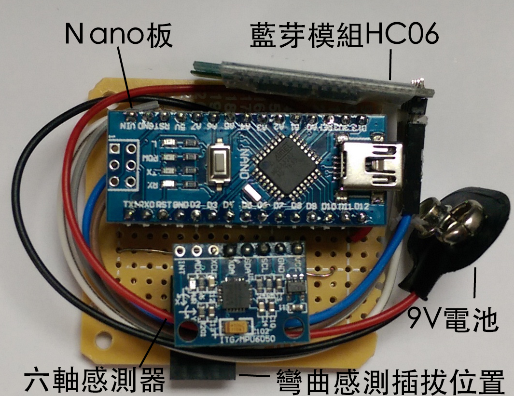
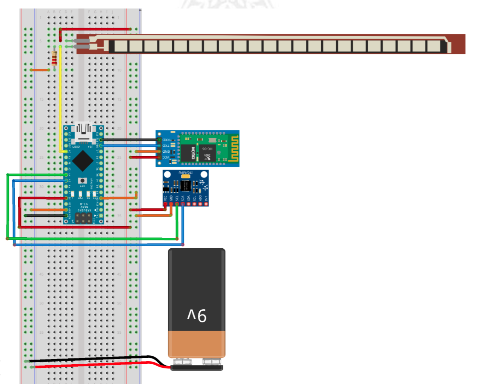
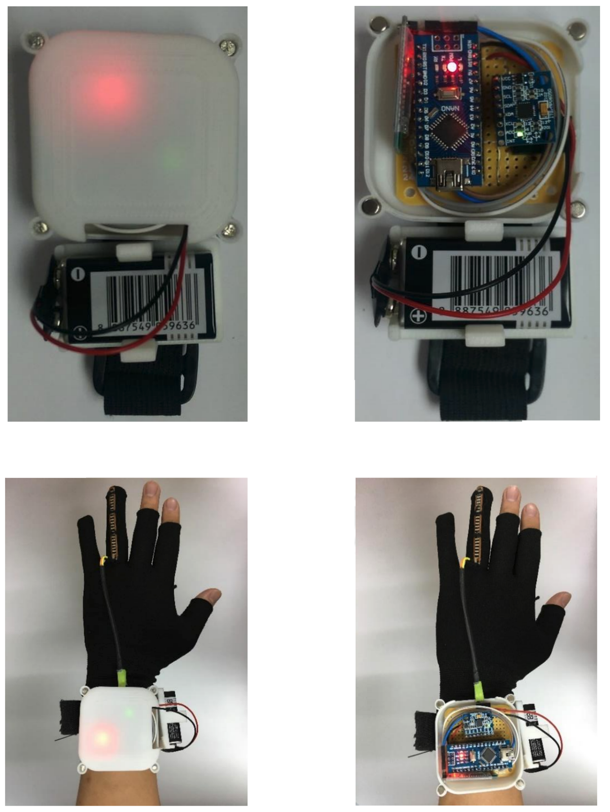

# MyTrainingSystem

穿戴式裝置設計主要透過Arduino Nano 板控制感測元件，並以Mpu6050 Sensor(六軸感測元件)及Flex Sensor 2.2(彎曲感測元件)進行肩部擺動及手指彎曲的數據收集，
再透過 HC-06 藍芽模組與 [**Android App**](https://github.com/percyku/HandTrainSystem2)進行數據上的傳輸。

# 穿戴裝置設計圖與實體

- Arduino元件

  

- 線路配置設計：

   

- 最終實體：

   

# 備註

- 此裝戴裝置應用在 [結合個人化健康傳播之遊戲式上肢訓練系統實作](https://ndltd.ncl.edu.tw/cgi-bin/gs32/gsweb.cgi/login?o=dnclcdr&s=id=%22105NTPT0787030%22.&searchmode=basic) 的碩士論文
- 需搭配 [Android App](https://github.com/percyku/HandTrainSystem2) 進行連線操作